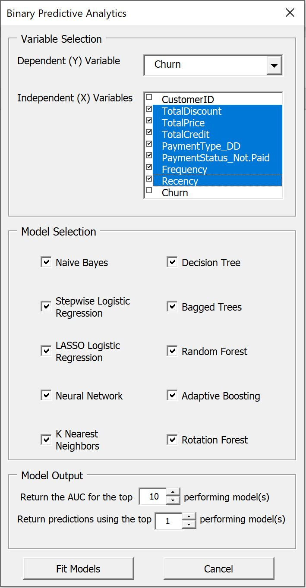
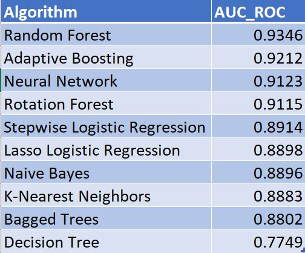
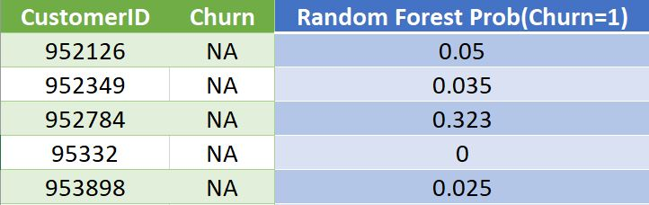

# R_Excel_UI

## Purpose ##
The purpose of these files is to enable those who have little to no experience with statistical programming to run powerful predictive algorithms using Excel as the UI. While working as an Analytics intern during grad school, one of my projects was to build out Excel Spreadsheets with customized capabilities. It was a blast, so I've decided to continue building my own R enabled Workbooks in my spare time.

## Functionality ##

The Excel Workbook loads with sample data in it to any combination of 10 popular Supervised Learning Algorithms. The user can replace the sample data with their own to get more meaningful predictions.

Once the desired data is in the Workbook, the user is presented with a UserForm to make decided the dependent and independent variables, the models they wish to estimate, and the amount of output they want to receive.

The Workbook operates by passing arguments to R through the command line. After the variable, modeling, and output decisions are complete, the command line runs the ML_Excel_UI RScript, producing two csv files. One containing model performance, the other containing predictions.

The two output csv files are automatically parsed into the Workbook, and look as follows:

### Model performance ###

### Model predictions ###

## Future Direction ##
As is, this project is great for quickly fitting several predictive models and benchmarking the typical predictive capabilities available. Many of these models can be greatly improved by parameter tuning, model optimization, and data visualization. Moving foward, I plan to add additional functionality and several more customizable parameters to better understand the relationships within the data and maximize the model's predictive accuracy.
