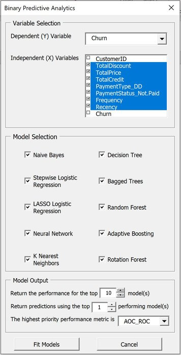
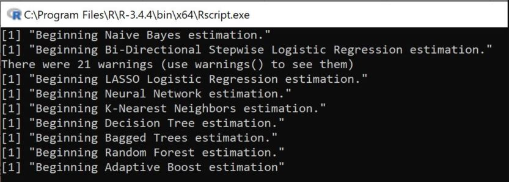
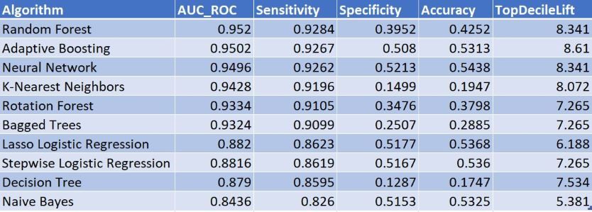
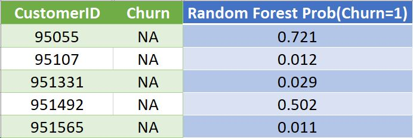

# R_Excel_UI

## Purpose ##
The purpose of this project is to enable those who have little to no experience with statistical programming to run powerful predictive algorithms using Excel as the UI. While working as an Analytics intern during grad school, one of my assignments was to build out Excel Spreadsheets with customized capabilities. It was a blast, so I've decided to continue building my own R enabled Workbooks in my spare time. 

This is the first version of this Workbook, thus the scope and flexibility of its usage is limited to fitting models and producing probabilistic predictions for binary response variables. Future versions will incorporate further parameter tuning, model optimization, and data visualization.

## Functionality ##

The Excel Workbook loads with sample customer attrition data by default. The user can easily replace the sample data with their own dataset. This project currently supports 10 popular Supervised Learning Algorithms.

The user will specify the dependent/independent variables, the combination of models they wish to estimate, and the desired amount of output through a VBA UserForm.

*Note that the 'highest priority' performance metric decides what the 'top' prediction will be. If only 1 set of predictions is to be returned and AUC_ROC is the highest priority performance metric, the predictions will be those from the model with the highest AUC_ROC.*

The Workbook operates by passing arguments from Excel to R through the command line. While the script is being executed, the command prompt will issue periodic updates as to the completion of the models. 

The R script, once complete, produces two .csv files containing model performance and predictions, respectively. These files are automatically parsed into the "Model Performance" and "Model Predictions" sheets of the Workbook.

An example of the output is included below:

### Model performance ###

*Note that the models will be ordered in descending order based on the highest priority performance metric*

### Model predictions ###

## Future Direction ##
As is, this project is great for quickly fitting several predictive models and benchmarking the typical predictive capabilities available. As mentioned briefly in the Purpose section, many models could see a significant improvement if their diagnostics were visualized and parameters tuned. Moving forward, options will be added for each individual algorithm to allow the user to specify specifically what they wish to see from each model. This will allow for an increase to the overall flexibility of this Workbook, a deeper understanding of the relationships behind the data, and aid in reaching each model's optimal predictive ability.
